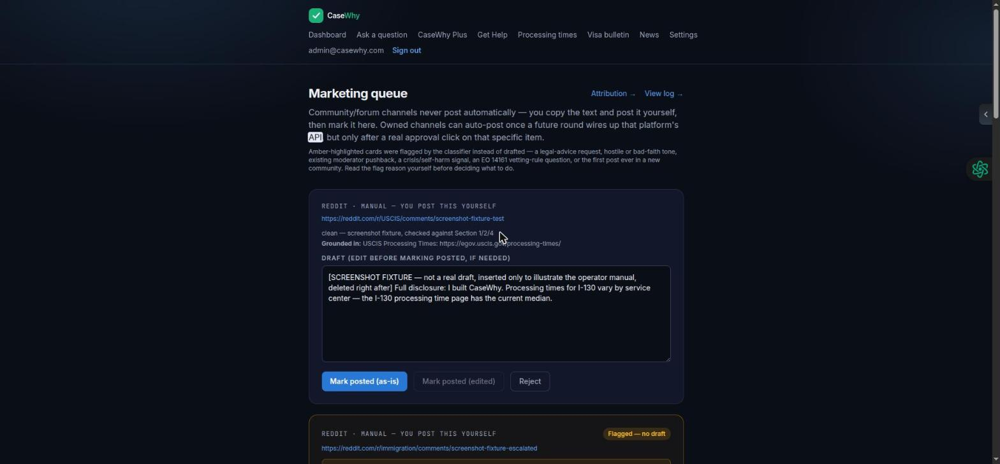
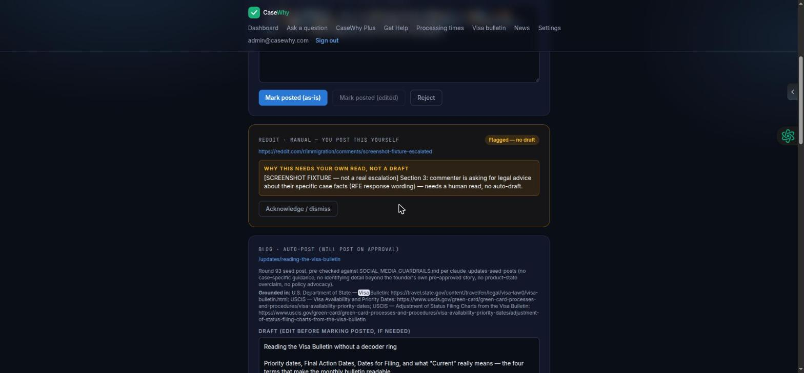
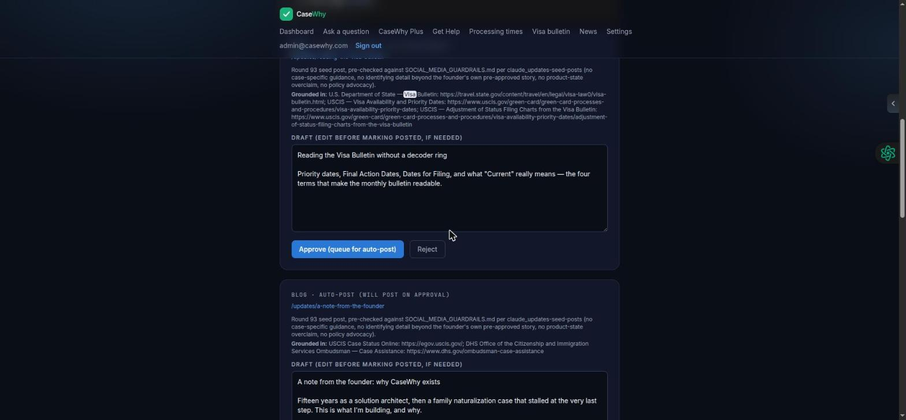
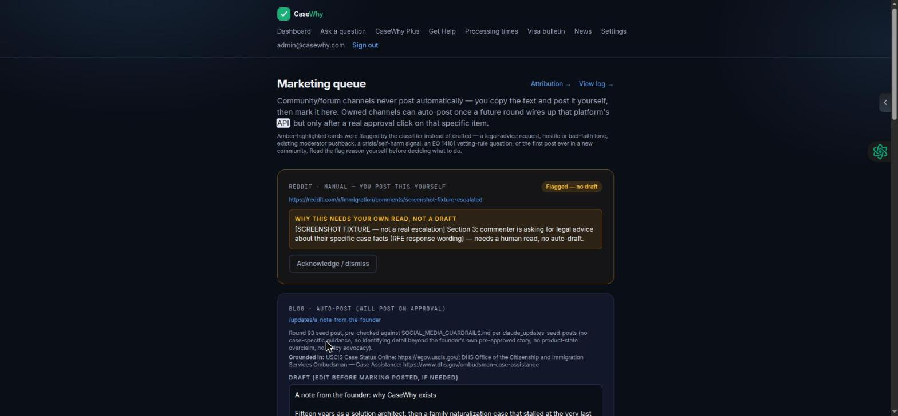
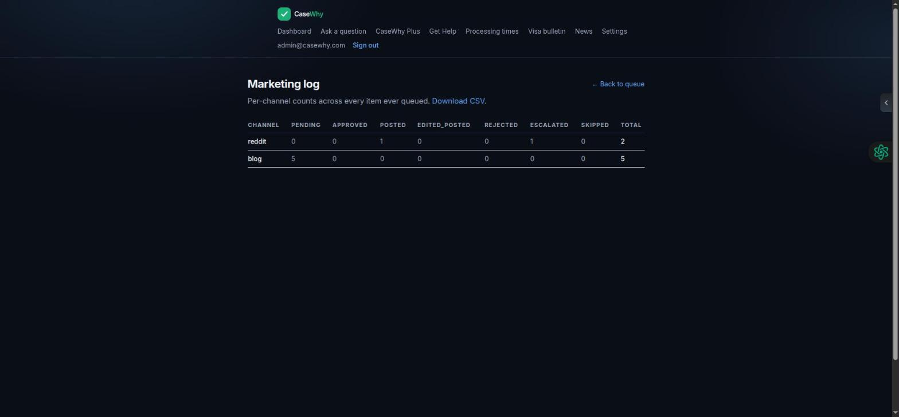
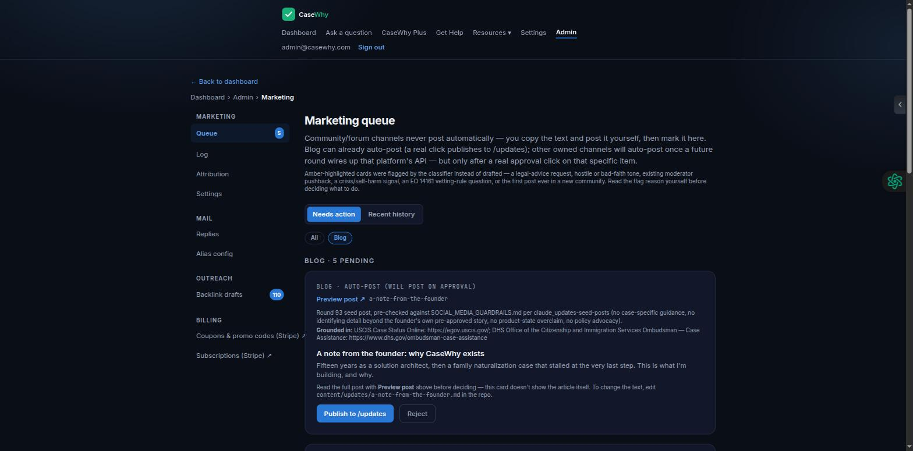
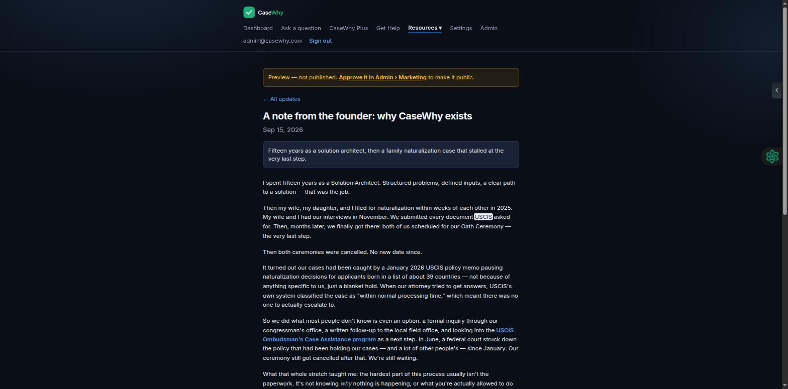
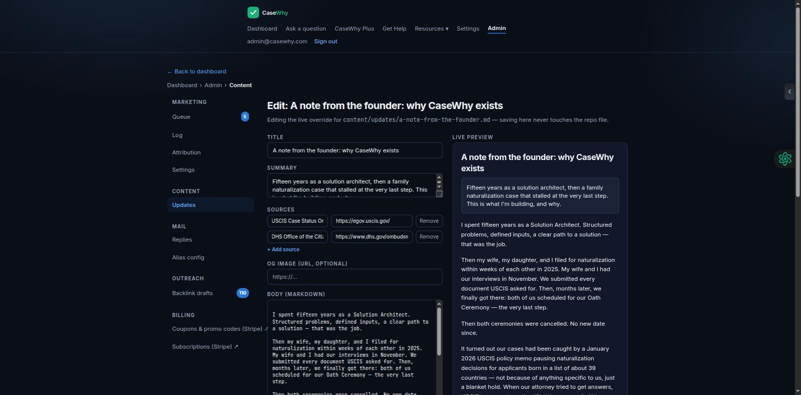

# CaseWhy Marketing Operations — Operator Manual

**Version 5, Sep 15, 2026 (v4 same day, v3 same day, v2 same day, v1 Sep 14). Audience: anyone working the marketing queues** — Peter today, a part-time helper or VA later. Written by the cloud Claude session from the round 85/89 specs and Claude Code's build reports; **Claude Code verified every screen label against the live UI before publishing this version.** v5 is Claude Code's round-108 pass — a one-line fix noting a post's date is its publish date, not its frontmatter date. v4 was the round-107 pass — the new in-browser editor, one new screenshot (#11). v3's Blog-section update and its two screenshots (#9, #10) were the round-103 pass — the cloud session's fuller rounds-101/102 navigation/chrome reconciliation is still owed separately. Sections marked *(coming — round NN)* describe behavior that is specified but not yet built; they will be unmarked as each round ships.

**Companion documents:** `SOCIAL_MEDIA_GUARDRAILS.md` (the rules every draft is checked against — read it once in full before your first shift), `marketing-ownership-and-peter-checklist.md` (who does what), `CaseWhy Free Marketing Playbook` (why each channel exists).

---

## 1. The one idea behind everything

CaseWhy never posts anything a human hasn't approved. Software finds the opportunities and writes the drafts; a person reads each one and clicks. There are two kinds of channel, and the click means different things on each:

| | Community channels | Owned channels |
|---|---|---|
| Which | Reddit, immigration.com, Facebook groups, Quora, other forums | X, Threads, LinkedIn Company Page, Pinterest, YouTube, TikTok, Instagram, the email list, the `/updates` blog, attorney outreach |
| Whose space | Someone else's | Ours |
| What "Approve" does | Marks the text **ready for you to copy and post yourself**, from your own logged-in account. Nothing is sent by software, ever. | Software posts or sends it for you, once, right after you click. |
| Queue mode label | `manual_post` | `auto_post` |

If a channel's posting integration isn't set up yet, an owned-channel item behaves like a community item: you get the text to copy. The queue tells you which is which on every card. As of this version, only one owned channel actually has a real poster wired up — the `/updates` blog (round 93). X/Threads/LinkedIn, Pinterest/YouTube/TikTok/Instagram, and email all still fall back to manual-post framing until rounds 90–92 ship.

---

## 2. Where the queues live

Admin pages need you to be signed in as the admin account — **`admin@casewhy.com`** (a dedicated admin credential, separate from the public `info@casewhy.com` inbox, since round 85). Anything else gets redirected away.

Since round 98 you never type an admin URL: sign in, and an **Admin** entry appears in the header (only for the admin account). It opens the **admin home** (`/admin`) — cards for every admin page with a pending-count badge — and every admin page carries the same left sidebar (top tabs on a phone) and a breadcrumb (`Dashboard › Admin › Marketing › Queue`). The sidebar groups: **Marketing** (Queue · Log · Attribution · Settings), **Mail** (Replies · Alias config), **Outreach** (Backlink drafts).

| Page | What it holds | Round |
|---|---|---|
| Admin › Marketing › **Queue** (`/admin/marketing`) | **The marketing queue.** Grouped by channel, one collapsible section per channel that has items (community channels first), escalated cards pinned to the top of their section. A channel-filter chip row and a **Needs action** / **Recent history** toggle (posted, edited, rejected — last 30 days, read-only). Filter and view live in the URL so a view can be bookmarked. | 89, 98 |
| Admin › Marketing › **Settings** (`/admin/marketing/settings`) | The subreddit reference list, the daily draft cap (editable, default 5), and `links_enabled` shown read-only. | 98 |
| Admin › Marketing › **Log** (`/admin/marketing/log`) | Per-channel counts across every status, all-time, plus a **Download CSV** link. You don't work this page; the cloud session reads it weekly. | 89 |
| Admin › Marketing › **Attribution** (`/admin/marketing/attribution`) | Which channel brought which sign-ups (landings / sign-ups / tracked a case / went Plus). Read-only. **Live**, not upcoming. | 93 |
| `app.casewhy.com/admin/community-replies` | The original community-only queue from round 85. **Removed.** Round 89 replaced it with `/admin/marketing`; this URL now returns a plain 404, it does not redirect. | 85 (retired) |
| Admin › Mail › **Replies** (`/admin/inbox`) | Replies to mail sent to `privacy@`, `help@`, `corrections@`, etc. **Separate system, deliberately** — business correspondence, not marketing. Not covered by this manual. | 70 |

---

## 3. Your daily routine (target: five minutes)

1. Sign in, click **Admin** in the header, then **Queue** (or open the Queue card on the admin home). The default **Needs action** view shows only Pending and Escalated items, grouped by channel; the badge on the sidebar entry is the count. Use the channel chips if you only want one channel today.
2. For each card, read what it shows (Section 4). Decide: **mark it posted after you post it yourself** (community/manual channels), **Approve** (owned channels with a real poster), or **Reject**.
3. For `manual_post` items you've posted: copy the final text, open the destination link, post it from your own account, come back, click **Mark posted (as-is)** (or **Mark posted (edited)** if you changed the text first).
4. Look at anything marked **Escalated** (Section 6). Those need a human read and either **Acknowledge / dismiss** once you've decided.
5. Close the tab. Don't go looking for more threads to answer — the monitor's daily cap is set low on purpose so this stays a five-minute job.

If you approve nothing on a given day, nothing goes out. The system is safe to ignore for a day; it just accumulates.

Note: **Skipped** items (the classifier decided a thread wasn't a real fit and never drafted) never appear in the queue. Skipped counts only show up on the log page (Section 9), for the cloud session to review. To see what you already posted or rejected, flip the toggle to **Recent history**.

---

## 4. Reading a queue card

Every card actually shows, in this order:

**Channel and mode**, top-left — e.g. "Reddit · manual — you post this yourself" or "Blog · auto-post (will post on approval)."

**Destination.** A link to the exact thread (or the post's own path, for owned-channel content). Open it before approving a community reply; the thread may have moved on.

**Guardrail notes.** A short line on how the draft was checked, or (for an Escalated card) the reason a human needs to decide instead. If this says anything that reads as a warning, slow down.

**Sources** ("Grounded in: ..."). Every factual claim should trace to a real source link here. A draft with a factual claim and nothing listed here is a draft to reject — the monitor is supposed to skip those, so one getting through is worth a note to the cloud session.

**Draft text**, in an editable box. The exact words proposed — edit directly in this box if you want to change anything before acting; there's no separate "edit mode," typing here *is* the edit.

What the manual originally described but the live UI does **not** currently show as separate elements: a structured "self-promo rule" note, and a visible "links enabled/disabled" indicator. Today, anything like that is folded into the guardrail-notes text if the draft mentions it, not a distinct field on the card.

---

## 5. The real decisions available on a card

The live UI doesn't have a generic "Approve" / "Edit" / "Leave it pending" set of buttons — what you actually see depends on the card:

**Escalated cards** (amber, no draft text): one button, **Acknowledge / dismiss**. There's no separate "Handled" vs. "Left" state — dismissing just clears it from the queue (recorded as `rejected`). Read the thread yourself first; decide whether to reply as yourself (never as CaseWhy) or leave it, *then* dismiss.

**`manual_post` cards** (every community/forum channel, and any owned channel without a real poster yet): **Mark posted (as-is)**, **Mark posted (edited)** (only enabled once you've actually changed the text), and **Reject**. There's no separate approve step — posting is something you do yourself outside the app, then you come back and mark it.

**`auto_post` cards with a real poster** (currently: Blog only): **Approve (queue for auto-post)** and **Reject** — except Blog, whose button reads **Publish to /updates** instead (same action, real-post-specific label, round 103). Approve/Publish is the one and only thing that makes the post go live — nothing else does.

**Reject** on any card is permanent; rejected items aren't retried. If you reject several drafts for the same reason, tell the cloud session — that's a prompt fix, not something you should keep doing by hand.

Leaving a card alone is fine for a day. After that, reject it — a community reply that's two days late reads worse than no reply.

---

## 6. Escalated items — the ones the software refuses to draft

An item shows as **Escalated** (amber-highlighted, "Flagged — no draft") when the guardrails say a human must decide. The categories (guardrails Section 3):

- The post reads as asking for legal advice about their specific situation.
- The commenter is hostile or clearly bad-faith.
- The thread already has moderator pushback or a self-promo warning.
- It's about the EO 14161 social-media vetting rule — anxious topic, deserves a calibrated human answer.
- It would be the first-ever post in a community CaseWhy has no track record in.
- **Crisis language** (self-harm or similar). Never reply as CaseWhy. If you reply at all, do it as a person, with the platform's crisis resources, and tell Peter.

What to do: read the thread, decide whether to answer as yourself (without CaseWhy), or leave it. Then click **Acknowledge / dismiss** so it clears. Escalations never get an auto-generated draft, even if you ask.

---

## 7. Channel-specific notes

**Reddit — manual, like Facebook and Quora.** Reddit denied CaseWhy's API application (Sep 15) and blocks feed reads from our servers, so nothing monitors Reddit automatically; the cloud session finds threads and drafts replies by hand, and they land in the queue as `manual_post` cards. Post from the Reddit account tied to `peter@casewhy.com`. Check the subreddit's self-promo rule (folded into the card's guardrail notes — see Section 4). No links until launch. If a moderator removes a post, screenshot it and tell the cloud session — the guardrails doc gets tightened, not just the one post. The subreddit list under Settings is a reference list, not a monitor.

**immigration.com and other forums.** Same rules as Reddit. The immigration.com feed is mostly firm announcements, so expect few drafts from it.

**Facebook groups and Quora.** The software does not monitor these (no API, and scraping would risk the account). The cloud session hands you candidate threads and drafts by hand, and they land in the queue like any other `manual_post` item. Post in your own voice; no links until a group admin has said yes.

**X / Threads / LinkedIn** *(auto-posting coming — round 90)*. Until then these are `manual_post`: copy the thread and post it yourself. Once round 90 ships, Approve posts it. Policy-news threads are time-sensitive — if one is more than a day old when you see it, reject it.

**Pinterest / YouTube Shorts / TikTok / Instagram** *(coming — round 91)*. Cards will carry an image or video preview plus caption. Look at the image: a headline the renderer garbled, a wrong logo, anything that looks off — reject, don't edit. The pipeline re-renders.

**Email issues** *(coming — round 92)*. One card per weekly issue, with subject, preview text, and full body. Approve = send to the whole list on the next Tuesday run. This is the one channel where a typo reaches every subscriber at once, so read the whole thing.

**Blog posts.** **Live (round 93), not upcoming.** One card per `/updates` post, channel label "Blog," `auto_post` mode with a real poster registered. Round 103 changed how you actually review one, because the card used to show only the post's title and a one-sentence summary — not enough to approve a 500–700 word article. Now: open the card → click **Preview post** (opens `/updates/<slug>?preview=1` in a new tab — a "Preview — not published" banner up top is the only difference from what a reader will see) → read the whole thing → back to the queue tab → **Publish to /updates** or **Reject**. The card itself has no textarea anymore; there's nothing to edit there. Publish is the one thing that flips a post from invisible to live at `/updates/<slug>`. There is no undo button; if you need to unpublish, tell the cloud session. A post's date is the day it was published from the queue — not whatever date is in the file (round 108).

**Editing a post's text — round 107, no deploy needed.** Click **Edit** next to Preview post on the card (or Admin › Content › **Updates**, which lists every post — published or not, edited or not — with its own Preview and Edit links). The editor is Markdown-only, deliberately no rich-text widget: Title, Summary, repeatable Source rows (title + `https://` URL, at least one required), and a Body textarea, with a live rendered preview right next to it so what you see there is exactly what publishes. **Save** writes an override that takes effect immediately, live or not — nothing here ever touches the repo file, and the queue card, the preview, and the public page (once live) all read the same edited version, so they can never disagree. **Revert to repo file** (a two-step button — click once, then Confirm) deletes the edit and goes back to exactly what's in `content/updates/<slug>.md`. Editing the *repo file itself* is still possible (ask the cloud session or Code) but is no longer the only way, and a saved edit here always wins over the file until you revert it.

**Attorney outreach** *(coming — round 94)*. The three sequence emails appear once for approval; after that, sends happen from the outreach tool and only replies come back through the round 70 alias queue (`/admin/inbox`). Complaint or bounce rates above the thresholds pause the sequence automatically.

---

## 8. Things you cannot change from the queue (and who can)

- **Product links are off** (`links_enabled = false`) until the paid tier and USCIS production access are both live. Drafts won't contain a CaseWhy URL and you shouldn't add one. Round 96 flips this; only Peter authorizes it.
- **The daily cap** (default 5 community drafts/day) and the **subreddit reference list** are editable under Admin › Marketing › **Settings** (round 98). Change the cap there if the queue feels too heavy or too quiet; tell the cloud session when you do.
- **The guardrails** are a document, not a setting. Nobody edits them casually — every change is dated and explained in the file.

---

## 9. Weekly (cloud session's job, listed so you know it exists)

Every Monday the cloud session reads `/admin/marketing/log` and the attribution digest (round 93, live — a weekly email to `info@casewhy.com` on Mondays covers the same numbers), checks approval and rejection rates by channel, tops up the content-brief and email-issue backlogs, and flags anything needing Peter's decision in one line. If rejection rates on a channel go above about a third, the drafting prompt for that channel gets revised — that's the feedback loop your Reject clicks feed.

---

## 10. Troubleshooting

| You see | It means | Do |
|---|---|---|
| No **Admin** entry in the header, or redirected away from an admin page | Not signed in as the admin account | Sign in as `admin@casewhy.com` |
| Queue empty for days | Normal pre-launch: Reddit/Facebook/Quora are manual (the cloud session hands you candidates), and the only automated source is a quiet RSS feed | Nothing — ask the cloud session for a batch of candidates if you want something to post |
| `auto_post` item stuck in "approved" without moving to "posted" | The channel's poster errored | Copy the text and post/publish manually; mark it accordingly; tell the cloud session which channel |
| A draft cites a figure you can't find at the source link | Sourcing failed | Reject; report it — this is the one failure that must never reach a post |
| Two near-identical drafts for different threads | Dedup missed | Approve/post one, reject the other, report it |

---

## What Claude Code corrected against the live UI (Sep 14, 2026)

The draft delivered from Drive got several real things wrong about the live product — corrected in this version, not just cosmetically:

1. **The admin account really is `admin@casewhy.com`** (the draft had this right) — confirmed directly against the live `ADMIN_EMAIL` value the app actually checks, not assumed from a local `.env.local` file that turned out to be stale (it still said `info@casewhy.com`, the value from before round 85 changed it).
2. **There is no filter control on `/admin/marketing`.** The page is hard-scoped to Pending + Escalated in the query itself — "filter to Pending" isn't a step, it's just how the page always looks.
3. **Card field order was wrong.** Real order is Destination → Guardrail notes → Sources → Draft text, not Destination → Draft → Sources → Guardrail notes.
4. **The "five decisions" (Approve / Edit then approve / Reject / Leave it / Mark posted) don't match the real buttons.** There's no standalone Approve or Edit button on `manual_post` cards — you edit directly in the draft box, then click **Mark posted (as-is)** or **Mark posted (edited)**. `auto_post` cards (only Blog has a real poster right now) show **Approve (queue for auto-post)** instead.
5. **Escalated items resolve with one button, "Acknowledge / dismiss," not "Handled" or "Left."**
6. **Skipped items never appear on the queue page** — only in the log's per-channel counts. The original draft said they'd show in the list.
7. **`/admin/community-replies` is gone entirely (404), not redirecting.**
8. **Round 93 had already shipped by the time this manual was written** — `/admin/marketing/attribution` and the Blog channel are both live, not "(coming — round 93)." Updated both sections.
9. **The alias approval queue's real path is `/admin/inbox`** — the original draft left it unspecified.
10. **The subreddit-list/daily-cap shot (#7 in the original shot list) didn't exist as a page at v1.** Round 98 built it the same day (Admin › Marketing › Settings) — see Section 8; screenshot still to be added.

Two small real bugs were found and fixed in the app itself while doing this verification, not just written around: the log page's per-channel table was missing a "Skipped" column (so channel totals silently didn't match the visible columns), and the channel-label map was missing entries for "Outreach" and "Blog" (falling back to the raw enum string). Both fixed, deployed, and confirmed live before the screenshots below were taken.

---

## Screenshots

All captured live against `/admin/marketing` on Sep 14, 2026, signed in as `admin@casewhy.com`. Two of the eight cards shown (a Reddit `manual_post` item and a Reddit escalation) are clearly-labeled test fixtures inserted only for these screenshots and deleted immediately after — the app currently has no other `manual_post` or escalated items to photograph, since Reddit polling isn't live yet (waiting on Reddit's API approval). The five real Blog cards visible are genuine round 93 seed posts, untouched — none were approved or rejected while taking these.

**1. The queue, a `manual_post` card in full.** Destination, guardrail notes, sources ("Grounded in:"), the editable draft box, and the real button set: **Mark posted (as-is)**, **Mark posted (edited)** (disabled until the text actually changes), **Reject**.

**2. An Escalated card.** Amber-highlighted, "Flagged — no draft" badge, the reason in place of a draft, and the single **Acknowledge / dismiss** control (not separate "Handled"/"Left" states).

**3. An `auto_post` card with a real poster (Blog).** **Stale as of round 103 — kept for history, not what you'll actually see.** This screenshot shows the pre-round-103 Blog card (destination link + editable draft textarea + "Approve (queue for auto-post)"). The real, current Blog card is #9 below.

**4. After clicking Mark posted on the fixture card.** It doesn't linger with a "posted" confirmation — it simply disappears from this view, because the page only ever shows Pending/Escalated items and a posted row no longer matches. The log page (next) is where a posted item is actually visible.

**5. Skipped items in the list view.** Confirmed: they don't appear here, at any point — only Pending and Escalated rows ever render on `/admin/marketing`. No screenshot to show, since there's nothing to show; see #6 for where skipped counts actually live.

**6. `/admin/marketing/log`.** Per-channel counts including the **Skipped** column (missing until this same session added it — see the corrections above) and the **Download CSV** link. The fixture reddit row's real `posted` count and `escalated` count are both visible here, confirming both actions from #1/#2/#4 actually recorded correctly.

**7. The admin config for the subreddit list and daily cap.** Now exists: Admin › Marketing › Settings (round 98). Screenshot to be added with the next verification pass, along with the admin home, sidebar, and the grouped queue.

**8. One card each for X, a pin, an email issue, and a blog post.** Only Blog is real as of this version — shown in #9 below. X/Threads/LinkedIn (round 90), Pinterest/YouTube/TikTok/Instagram (round 91), and email issues (round 92) don't exist in the live queue yet; add their screenshots to this section once those rounds ship.

**9. The current Blog card (round 103).** No textarea — read-only title and summary, a **Preview post ↗** link (opens the real article in a new tab, admin-only), the slug in small mono text, and **Publish to /updates** / **Reject** buttons. Captured live against a real, still-pending seed post — nothing was published or rejected while taking this.

**10. The `?preview=1` banner on the post itself.** What clicking **Preview post** opens — the full article exactly as it will read once published, with one addition: an amber "Preview — not published" banner linking back to the queue. No share button, no JSON-LD, `noindex, nofollow` — none of that is visible in a screenshot, but confirmed via the page's own meta tags and source before this was taken.

**11. The round-107 editor, open on a real post.** Title, Summary, repeatable Sources, Body (Markdown), and the live preview on the right rendering the same content in real time. Captured on the founder's-note post with no edit actually saved — the override was left clean afterward, confirmed via a direct DB check (zero rows in `updates_overrides`) before and after.

